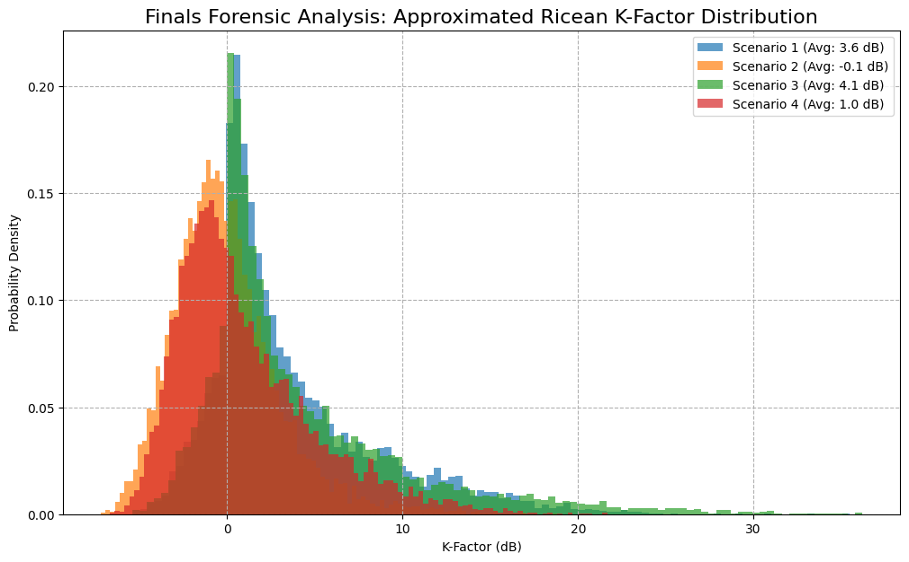
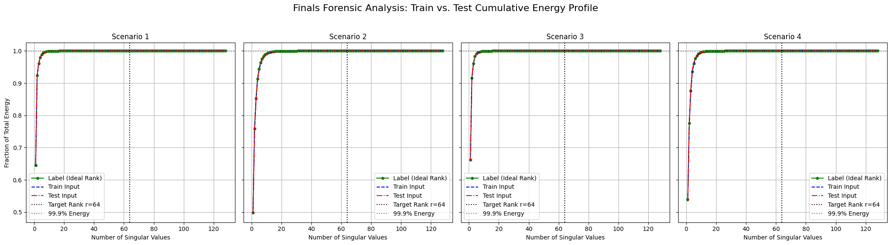

# LoMACS-SVDNet: Orthogonality without Decompositions

> **AI-Enabled Robust SVD Operator for Wireless Communication**  
> End-to-end network that predicts `(U, S, V)` for large MIMO channels **without any QR/SVD/EVD/inversion** inside the network.  
> Final score aligns with the official metric: `Score = 100 × AE + MACs`.

**Competition Result**: Final Score **63.0** — **4th place (Third Prize)** at **Huawei Tech Arena 2025**.

<p align="center">
  
</p>

## 1. Highlights

- **Axial Low-rank Frequency Gate (ALF)**: 2D-FFT front-end gating keeps informative angle/delay bands; hidden size is **structurally prunable**.
- **Grouped Projected Attention (GPA)**: K/V column projection with length `k_len` → complexity `O(T·k_len)`; interpretable column dictionary; **prunable by energy**.
- **Gated Depthwise-Conv**: local smoothing with very low MACs.
- **Neural Ortho Refiner (NOR)**: one-step, decomposition-free orthogonality refinement on the Stiefel manifold; learns step sizes `(a, b)`.
- **Spectral Self-Calibration (SSC)**: annealed blend of predicted `S` and measured `|diag(UᴴHV)|`.
- **AEPlus Loss**: `L_rec + λ L_ortho + w_E L_energy + w_D L_diag + w_S L_smatch` with smooth schedules.
- **Step-3 Structured Pruning**: rebuild a smaller isomorphic network (no masks) → **real MACs drop** under PyTorch Profiler; short finetune recovers AE.
- **Train/Prune/Infer Unified**: one `model.py` driving the full pipeline.

## 2. Repository Layout

```
.
├── model.py          # train / prune_ft / infer
├── scripts/          # convenience shell scripts
├── docs/             # analysis plots used in README
├── ckpts/            # checkpoints (ignored by git)
├── submissions/      # npz outputs (ignored by git)
├── requirements.txt
└── .gitignore
```

## 3. Installation

```bash
conda create -n svdnet python=3.10 -y
conda activate svdnet
pip install -r requirements.txt
```

## 4. Data Preparation

Place the official data (e.g. `CompetitionData2`) under `./data2/`, following the organizer’s naming:
```
data2/
  Round2CfgData1.txt
  Round2CfgData2.txt  
  Round2CfgData3.txt  
  Round2CfgData4.txt  
  Round2TrainData1.npy...
  Round2TrainLabel1.npy...
  Round2TestData1.npy...
  
```

## 5. Quick Start

### 5.1 Train (Step-1/2 → Step-3 prune → finetune → best.pth)

```bash
python model.py \
  --mode train \
  --data_dir ./data2 \
  --out_dir ./submissions
```

> During training, the code measures real Mega MACs using `torch.profiler` and prints `val_AE`, `MACs` and `Score`.

### 5.2 Prune + Finetune existing Step-1/2 checkpoint

```bash
python model.py \
  --mode prune_ft \
  --data_dir ./data2 \
  --src_ckpt ./ckpts/preprune.pth \
  --keep_klen 28 --keep_hidden 28 \
  --ft_epochs 60 --ft_lr 2e-4
```

### 5.3 Inference & Packaging for Submission

```bash
python model.py \
  --mode infer \
  --data_dir ./data2 \
  --ckpt ./ckpts/best.pth \
  --out_dir ./submissions/round2
```

This produces `1.npz`…`4.npz` under `--out_dir`, each containing keys **`U, S, V, C`**.  
`C` is the Mega MACs measured by PyTorch Profiler, used in the final score.

## 6. Model Notes

- **Compliance**: No QR/SVD/EVD/inversion is used inside the network. Orthogonality is enforced by loss + NOR.
- **Normalization**: per-sample Frobenius normalization during train/test; we rescale `S` back at inference.
- **Augmentation**: power-aware complex noise and random antenna (row/column) dropout.
- **Complexity**: `get_avg_flops()` calls PyTorch Profiler to compute **real MACs / sample**, avoiding proxy FLOPs.

## 7. Reproduce Our Setting

The defaults in `make_cfg()` reflect our final setting:
- `DIM=64`, `DEPTH=2`, `GROUPS=4`, `K_LEN=32 → 28` (after pruning), `GATE_HIDDEN=32 → 28`
- Schedules: `λ` ramp; `τ: 0.90 → 0.60`; `w_E, w_D, w_S` smoothly decay.
- Finetune: `epochs=60`, `lr=2e-4`.

## 8. Visualization

<p align="center">
  
</p>

<p align="center">
  
</p>

## 9. License

This repository is for the competition/research purpose. Commercial use is subject to the organizer’s policy.

## 10. Acknowledgements

Thanks to the organizers and the open-source community.
